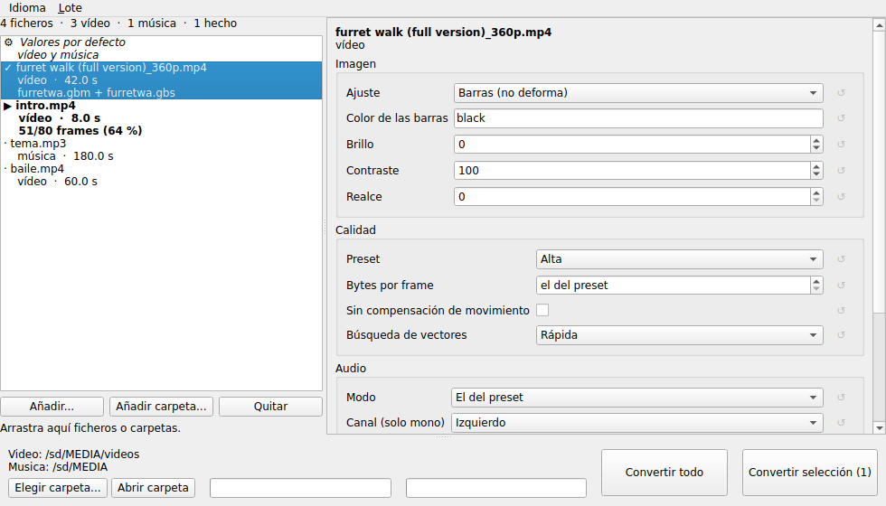

**English** · [Español](README.es.md)

# FilmPlay for the EZ Flash Omega

GBA Movie Player was a 2004 accessory for watching video and listening to
music on a Game Boy Advance from an SD card. Later on, its ROM was released
adapted to work with the Supercard SD Mini flashcart (called FilmPlay.gba).
Over the years, FilmPlay.gba fell into obscurity, since it wasn't compatible
with modern flashcarts.

Now, with Claude's help, I reverse engineered the original ROM, and, thanks
to the [gba-flashcartio](https://github.com/afska/gba-flashcartio)
library, I managed to adapt it to work with the EZ Flash Omega (and DE).

To work, FilmPlay.gba uses a proprietary format for video and music (a
.gbm+.gbs pair for videos, and just .gbs for music). Since the original
converter only ran well on Windows XP and needs very old codecs, I also
reverse engineered the formats and built a modern converter.

| | |
|---|---|
|    |  |
| On the GBA | Converter program |

| | |
|---|---|
| [`ezfo-patch/`](ezfo-patch/) | The patch to the original ROM, adding EZ Flash Omega compatibility |
| [`gbamedia/`](gbamedia/) | The video and music converter to `.gbm`/`.gbs`, replacing the original |

While developing this patch I also wrote an mGBA (0.10+) script that
emulates an EZ Flash Omega's SD interface, for debugging GBA programs that
talk to the SD card (available from the `sdcard` repository/folder).

## Using it

In order to use FilmPlay, your EZ Flash Omega (DE)'s SD card must be ≤256GB, be formatted to FAT32 and have 32KB clusters.

You need the **GBA Movie Player ROM** for the **Supercard SD** (filmplay.gba),
which must be obtained legally.

**1. Patch the ROM**: download `ezfo-patch.zip` from the repository's
**Releases** and unzip it. With your own ROM copied into that folder:

    python3 patch.py FilmPlay.gba FilmPlay-EZFO.gba

**2. Convert your video and music**: download the package for your system
(Windows, macOS or Linux) from the repository's **Releases** and unzip it.

Two versions are included: `gbamedia-gui` (the GUI, for everyday use) and
`gbamedia` (the CLI the GUI relies on).

It takes modern formats (mp4, mkv, mp3, m4a...) and converts in batches. The
[`gbamedia/` README](gbamedia/README.md) covers the rest of the options.

## Developing

The repository has three main folders:

* `ezfo-patch`: builds the patch to the original FilmPlay ROM so it works
  with the EZ Flash Omega, using C and GBA assembly. Needs Python and
  devkitPro's gba-dev. Can be built with `make`
* `gbamedia`: the new converter to FilmPlay's format, along with the
  documents describing the format. Written in Python, with an optional C
  core for more speed
* `sdcard`: holds the mGBA SD emulator (Lua). More information in its own
  repository

## Licence

GPL-3.0-or-later, for the code in this repository. `gba-flashcartio` is MIT.
