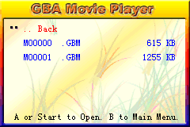
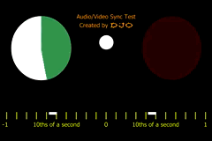
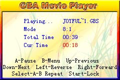

**English** · [Español](README.es.md)

# gbamedia

Video and music converter to GBA Movie Player's `.gbm` and `.gbs` formats, for
EZ Flash Omega/DE cards. A single application: it decides what to do from the
input file.

The formats, reverse engineered, are documented in
[`re_gbamedia/GBM_FORMAT.md`](re_gbamedia/GBM_FORMAT.md) and
[`GBS_FORMAT.md`](re_gbamedia/GBS_FORMAT.md); that is where the
reason for almost everything this code does lives.

## Development

Everything inside the project `venv`, nothing global:

    make venv        # creates .venv, installs editable and builds the C
    make c           # rebuilds the extension after touching the .c
    make test        # fast suite
    make puro        # the same suite without the C core
    make lento       # walks the original files end to end

The C extension is **optional**: with no compiler the package still installs
and everything works on the Python core, just slower. `GBAMEDIA_PURO=1`
disables it even when built, which is how the two are compared.

## Usage

    gbamedia video.mp4 song.mp3 -v /sd/MEDIA/videos -m /sd/MEDIA
    gbamedia --solo-analizar video.mp4      # cadence warnings, no conversion
    gbamedia video.mp4 --bpm 140:150        # fixes the animation slipping
    gbamedia folder/ --preset compresion --verificar
    gbamedia video.mp4 --arreglar-cadencia  # applies what the warning proposes
    gbamedia video.mp4 --trabajos 4         # how many workers to use

With no arguments it opens the window; with them it acts as a terminal
converter. A video yields a `.gbm` + `.gbs` pair; anything else, a lone `.gbs`.
`gbamedia --help` lists everything.

### How the output is named

After the source file name, trimmed to 8.3:
`furret walk (full version)_360p.mp4` -> `furretwa.gbm` + `furretwa.gbs`.

The original converter's `Mnnnnn` is **not mandatory**: FilmPlay's listing
filters by extension (`GBM/GBS/WAV/TXT` table at `0x080C11F4`, validated in the
emulator) and accepts any name; checked in mGBA with `CORTO.GBM` and
`FURRET~1.GBM` next to the `M0000n` files, all listed and playable. The **audio
mode** is not tied to the video preset either, unlike in the original
converter: it travels in the `.gbs` header and the player honours it, checked
with the two combinations no original file ever used (compression + 8:1 stereo,
and high + 11:1 mono). What the ROM does impose is **8.3**: it reads short
directory entries, so a long name shows up on the console as `FURRET~1.GBM`.
That is why the trim happens here: what you choose is what you read on the GBA.

Converting the same file twice **replaces** its output instead of leaving
another one beside it. Two different sources that trim to the same name are
resolved with a suffix (`furretwa`, `furretw2`). `--numerar` goes back to
`Mnnnnn` numbering, and `--nombre` pins a specific one.

### Speed

The codec lives in a C extension (`src/gbamedia/core/_fast.c`): the partition
tree, the vector search, the ADPCM and the verification decoder. The Python
equivalent stays as the **reference implementation** -it is the one you read to
understand the format- and the tests demand that the two produce the **same
byte**, not a similar result.

On top of that, a video is cut into 25-frame chunks spread across every core.
The format has no keyframes -the decoder only applies differences- so a chunk
starting against a black framebuffer is described in full and yields an equally
valid file; the original converter did the same every 600 frames on its own. It
costs 1-2 % in bytes and does not show in quality (31.90 dB with and without
chunking, over 30 s of real video).

Measured on this machine (16 cores) with a 107 s video:

| | per frame, one core | the whole video |
|---|---|---|
| numpy, not spread | 515 ms | 9 min 14 s |
| numpy spread | 515 ms | 38 s |
| C, single thread | 7.2 ms | 9.8 s |
| **C spread** | **7.2 ms** | **3.8 s**, `--verificar` included |

That is 28 times faster than watching the video. Audio runs at about 900 times
real time, and the verification decoder 100 times faster than the Python one.

`--trabajos N` limits the workers and `--trozo N` the chunk size (`0` disables
chunking). With the C core the work is spread across **threads** -the C
releases the GIL, so frames need not be copied anywhere-; without it, processes
are needed. Music is not chunked, because ADPCM is sequential end to end, but
several songs are converted at once.

### Batches

Options come in three layers, lowest to highest priority:

    defaults  <  batch profile  <  per-file override

And the defaults are two sets, one for video and one for music: almost nothing
that decides a video matters to an mp3. A batch manifest is a JSON holding all
of it:

```json
{
  "perfil_video": { "preset": "estandar" },
  "perfil_musica": { "modo_audio": 0 },
  "salida": { "video": "/sd/MEDIA/videos", "musica": "/sd/MEDIA" },
  "ficheros": [
    "intro.mp4",
    { "origen": "dance.mp4", "opciones": { "tempo": 1.071429 } },
    { "origen": "theme.mp3", "opciones": { "modo_audio": 1 }, "nombre": "theme" }
  ]
}
```

    gbamedia --lote lote.json
    gbamedia folder/ -p estandar --guardar-lote lote.json   # writes it

It is the same format the window uses, so a batch prepared by hand opens in the
interface and the other way round. Paths are read relative to the manifest. A
bare `"perfil"` (the old format) applies to both classes.

### Languages

Spanish and English. By default the system's: Spanish if the system is in
Spanish, English otherwise. Change it from the window's **Language** menu
-which remembers the choice- or with `--idioma es|en` in the terminal; the
`GBAMEDIA_IDIOMA` variable overrides both.

The source strings are the Spanish ones in the code, and the English catalogue
lives in `src/gbamedia/languages/en.py`. `tests/test_i18n.py` extracts every
`_()` call from the code and fails if any is untranslated, which is what keeps
half the window from staying in Spanish.

### Simple mode and DEBUG_ON

The cadence warnings (fps and BPM) and their controls -frame blending, tempo
factor- are **not shown** unless a file named `DEBUG_ON` sits next to the
executable. The cadence heuristic can get it wrong on real material and
propose a nonsensical correction, and a wrong warning sends you off to break
a video that was fine. The options still work in the terminal even though
they are not announced in `--help`.

### The window

    make gui

On Linux, Qt 6.5+ loads its X11 plugin with `dlopen` and needs a system library
that many minimal distributions (WSL included) do not ship:

    sudo apt install libxcb-cursor0

Without it the window does not open and Qt says "no Qt platform plugin could be
initialized". The command line works fine with nothing installed.

File list on the left, parameters of the selected one on the right. With no
selection you edit the **defaults**, which have one tab for video and one for
music and show only the groups that matter to each class. With several files
selected you edit them all at once and the fields that disagree are marked
"(varios)". Every control has a ↺ button to return to the batch value.

The first row of the list is the **defaults**, with its two tabs; selecting
files shows theirs.

You convert with **Convert all** or **Convert selection**, and the right-click
menu over the list also offers re-converting one already done -which replaces
its output-, analysing its cadence without converting it, and opening the
output folder. The folder is asked for the first time it is needed -there is no
invisible default destination, which was what made finding the output
impossible- with a dialog that, depending on a checkbox, asks for one path or
two, plus another to put videos in a `videos/` subfolder. Neither is mandatory:
the ROM lists by extension and does not care about the tree.

What does matter is that **FilmPlay pairs a `.gbm` with the `.gbs` of the same
name**, so with video and music in the same folder a music `.gbs` named like a
video would become its soundtrack. This is checked and warned about before
converting, both in the window and in the terminal.

While converting, the list marks each file with its state (`·` pending, `▶` in
progress with its percentage, `✓` done with the files it left, `✗` failed with
the reason) and along the bottom go the current file, what is left and two
bars: the file's and the batch's. The button becomes **Stop**, which releases
the chunks that have not started and notifies the ones that have, so it cuts in
under a second and leaves nothing half done. Closing the window **with a
conversion running** asks before cutting it off; with the list loaded and idle,
it does not get in the way.

Cadence warnings appear in the file's panel with an **Apply** button that
writes the needed adjustment: nobody should have to copy a six-decimal tempo
factor by hand. In the terminal, the same with `--arreglar-cadencia`.

## Packaging

    make dist

Leaves `dist/gbamedia/` with two executables: `gbamedia` (console) and
`gbamedia-gui` (no console, for the shortcut). `ffmpeg` and `ffprobe` are
copied from `bin/` and located by a path relative to the executable, never via
`PATH`. **PyInstaller 6 puts everything bundled into `_internal/`**, so in the
package they end up in `dist/gbamedia/_internal/bin/`; that is where the
locator looks (`sys._MEIPASS/bin`), and that is why next to the `.exe` you only
see the two executables. The C extension travels inside the package, built on
the platform that builds each binary.

### Windows without leaving WSL

If the host is Windows with WSL2, no virtual machine or CI is needed:

    ./packaging/windows.sh

(or `make windows`) copies the tree to a Windows folder -`C:\gbamedia-build` by
default; `DESTINO=` or `packaging/local.env` change it- and sets up a venv
there with the Windows Python, **builds the C extension with MSVC**, downloads
`ffmpeg.exe` and `ffprobe.exe` (BtbN's GPL build, hosted on GitHub), runs the
suite and leaves `dist\gbamedia\gbamedia.exe`. It needs Python 3.11+ and the
Visual Studio Build Tools on the Windows side; `PYWIN=` changes the
interpreter.

The `.gbm` produced by the Windows binary is **byte for byte identical** to the
Linux one (checked with MSVC/cp311 against gcc/cp312): the codec is integer
arithmetic from beginning to end, so any difference would be a portability bug,
not a licence to vary.

The packages for all three platforms are built by
`.github/workflows/package.yml` with a GitHub Actions matrix: zip on
Windows, zip on macOS and an AppImage on Linux. Linux is built on the oldest
reasonable image, because the binary only runs on a glibc as new as or newer
than the one on the machine that built it.

Unsigned macOS requires right-clicking to open the first time; avoiding that
needs an Apple developer account.

The golden tests use the `.gbm`/`.gbs` files generated with the original
converter. They are looked for in `../ezfode_sd/MEDIA`; `GBAMEDIA_ORIGINALES`
points elsewhere. If they are missing, those tests are skipped.

## Status

| Phase | What | State |
|---|---|---|
| 0 | Scaffolding and golden tests | done |
| 1 | `.gbs` audio encoder | done, **byte for byte** |
| 2 | `.gbm` video encoder | done |
| 3 | Modern input, scaling and cadence | done |
| 4 | CLI | done |
| 5 | GUI | done |
| 6 | Batches | done |
| 7 | Packaging | done |
| 8 | C core | done, **byte for byte** against the Python one |

## Tested in the emulator

The files the converter produces play back in mGBA with the ROM's decoder,
served from a virtual card built with the **virtual SD card** project (separate
repository): it builds the image, hooks the patch blob (`_EZFO_startUp` and
`_EZFO_readSectors`, with the addresses taken from `ezfo-patch/ezfo.sym`) and
serves the sectors from it.

| | |
|---|---|
|  |  |
| The FilmPlay menu | The listing, with the right sizes |
|  |  |
| High preset: small text legible | Standard preset, with motion compensation |
|  |  |
| The same video spread over 25-frame chunks | A `.gbs` from an mp3, with its duration |

| Test | File | Result |
|---|---|---|
| Listing | both | correct sizes: `M00000.GBM` 615 KB, `M00001.GBM` 1255 KB |
| Lossless video | `M00000` (high preset, 300 frames) | plays back; small text legible |
| Video with vectors | `M00001` (standard preset, 280 frames) | plays back clean, no drift or displaced blocks |
| Chunked video | `M00001` in 25-frame chunks | just as clean: the seams do not show (cut frames lose 1.8 dB for a tenth of a second) |
| C core | both, regenerated with the extension | play back identically; the file is byte for byte the same as the Python core's |
| Free names | `CORTO.GBM` and a long name next to the `M0000n` files | lists all four with their size and plays the freely named one with its audio; the long one shows as `FURRET~1.GBM` |
| Free audio mode | compression + 8:1 stereo, and high + 11:1 mono | the two combinations the original converter never emitted with video play back the same: the mode travels in the `.gbs` header and the player honours it |
| Music | `.gbs` from an mp3 | "Playing... Mode 8:1, Total Time 00:39", the time advances |
| End of file | `M00000` -> `M00001` | chains into the next one without a single garbage frame |

The vector one is the one that matters: 280 frames of motion compensation
decoded by the ROM without accumulating error, meaning the deduced vector
table, the linear offsets and the packed colour addition are correct. And since
that file is made in chunks, it also proves that spreading the video across
processes leaves no seams.

What the emulator **cannot** validate is the real SD read path on the Omega.
That still needs the GBA.

## Licence

GPL-3.0-or-later.
